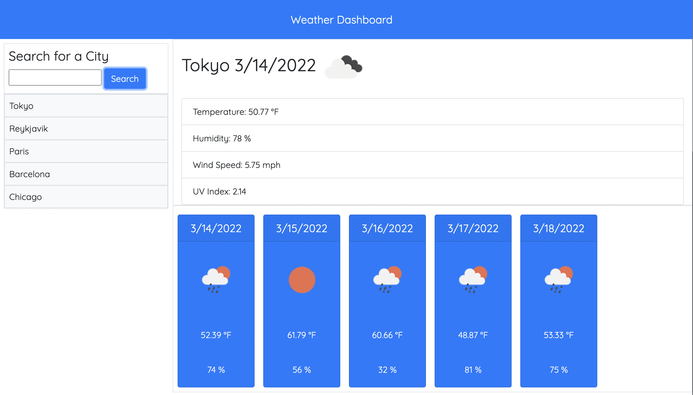

# Weather Dashboard

An app that uses the OpenWeatherMap API to search for a city and return current weather information and a 5-day forecast. Previously searched cities are added to "History" and can be clicked to search again.

Technologies:
- HTML
- CSS Bootstrap 4.3
- Javascript
- OpenWeatherMap API - Geocoding and OneCall

---

[Link to Site](https://jenniwritescode.github.io/weather-dashboard/)

---
# screenshot

