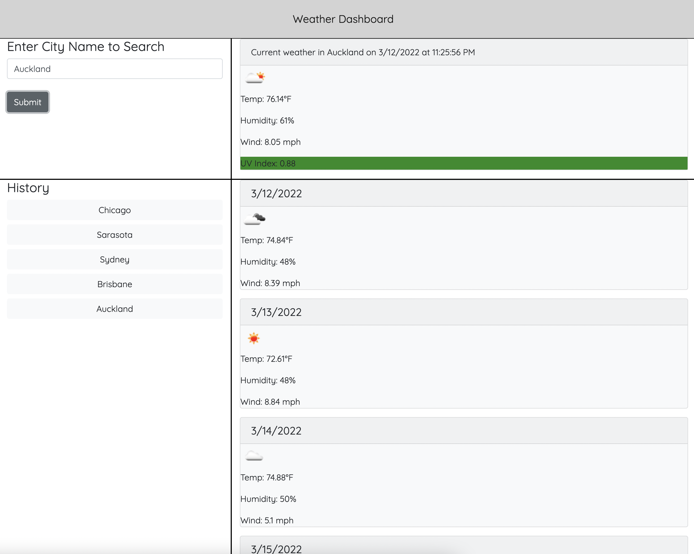

# weather-dashboard

An app that uses the OpenWeatherMap API to search for a city and return current weather information and a 5-day forecast. Previously searched cities are added to "History" and can be clicked to search again.

This app uses CSS Bootstrap 4.6.

### status as of 3/12/22

Styling still needs work to make forecast cards to line up horizontally instead of vertically.

---

[Link to Site](https://jenniwritescode.github.io/weather-dashboard/)

---
# screenshot

